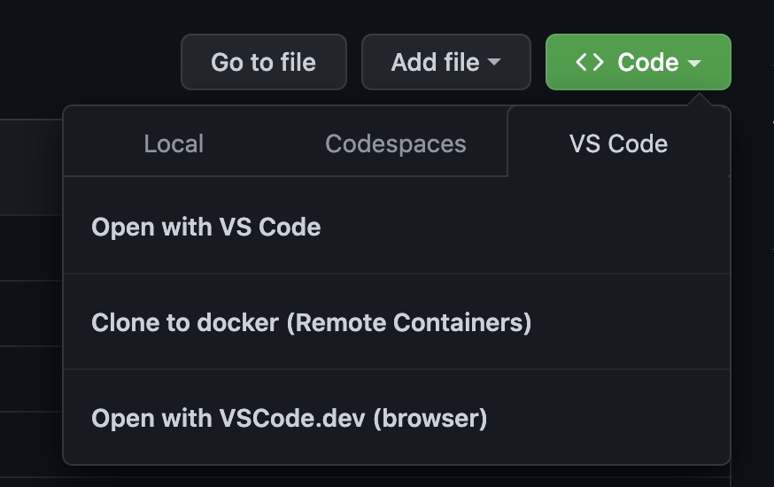

# Open with VS Code Chrome Extension
this extension allows you to open github repos in vscode with remote container (local codespace), strict read mode and vscode web app options.

# Install
clone it to your local and load it as unpacked extension on `chrome://extensions` page

# Screenshots

